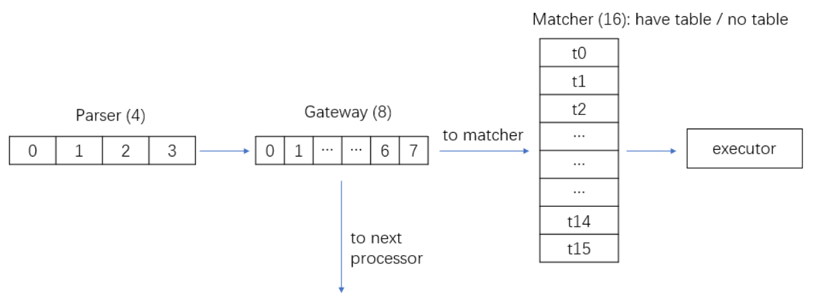

> 待解决问题: header.isValid()的匹配问题；HIT MISS的处理问题

> parser miss问题

---

---

**rP4->JSON 控制器需要的信息定义** (2022.01.19)

*Global*

- SRAM: array, SRAM_NUM_ALL
    - width: SRAM_WIDTH
    - depth: SRAM_DEPTH
    - uint8_t tbl[SRAM_WIDTH * SRAM_DEPTH / 8]
- TCAM: array, TCAM_NUM_ALL
    - width: TCAM_WIDTH
    - depth: TCAM_DEPTH
    - uint8_t tbl[TCAM_WIDTH * TCAM_DEPTH / 8]
    - uint8_t mask[TCAM_WIDTH * TCAM_DEPTH / 8]

1. parser
    - parser_level: indexed by procId
    - parser_tcam_entry (key):
        - current_state: 8-bit
        - entry: 32-bit
        - mask: 32-bit
    - parser_sram_entry (value):
        - hdr_id: 8-bit
        - hdr_len: 16-bit
        - next_state: 8-bit
        - transition_field_num: 8-bit (在transition select中的字段数量)
        - transition_fields: list
            - hdr_id: 8-bit
            - field_internal_offset: 16-bit
            - field_length: 16-bit
            - field_type: FIELD, VALID, HIT, MISS (if VALID, only hdr_id, field_length work; if HIT/MISS, all three don't work)
        - miss_act: 8-bit， 表示在next_state的transition中，如果查不到匹配字段应该执行的动作：0 accept, 1 drop
    - **update function**
        - clearParser(procId, parser_level)
        - insertParserEntry(current_state, entry, mask, hdr_id, hdr_len, next_state, transition_field_num, transition_fields)

2. gateway
    - bitmap: 8-bit，switch()的值
    - exps: vector\<RelationExp\> 逻辑表达式集合
        - param1: GateParam
            - type: FIELD, CONSTANT
            - union value
                - constant_data: CONSTANT
                    - data_len
                    - val: uint8_t[]
                - field: FIELD
                    - hdr_id: 8-bit
                    - field_internal_offset: 16-bit
                    - field_len: 16-bit
                    - field_type: FIELD, VALID, HIT, MISS
        - param2: GateParam
        - relation
            - \> < >= <= == !=
    - res_next_proc: map\<bitmap, int\> 字典，相应的判断值得到相应的next_proc_id，如果等于cur_proc_id，则执行下面的matcher;若不等，跳转到下个proc
    - res_next_matcher: map\<bitmap, int\> 字典，根据判断值得到相应的matcher_id（如果cur_proc_id==next_proc_id的话）
    - **update function**
        - clear_all()
        - insert_exp(exp)
        - clear_res_next()
        - modify_res_map(key, proc_id, matcher_id, action_id)

3. matcher
    - proc_id
    - miss_act_bitmap: uint8_t[MATCHER_THREAD_NUM], inidicate whether to execute default action by 0 1
    - matcher_thread[16]: 每个matcher中会有16个matcher_thread
        - proc_id
        - no_table: true, false, 该thread是否有table
        - match_type: Exact, Ternary, LPM
        - SRAMs[SRAM_NUM_PER_CLUSTER]: pointer to global SRAMs
        - TCAMs[TCAM_NUM_PER_CLUSTER]: pointer to global TCAMs
        - union key_config
            - sram_key_config: uint8_t[SRAM_NUM_PER_CLUSTER]
            - tcam_key_config: uint8_t[TCAM_NUM_PER_CLUSTER]
        - union key_width
            - sram_slice_key_width: e.g., 200-bit key, 128-bit SRAM_WIDTH, the value is 2
            - tcam_slice_key_width
        - union key_depth
            - sram_slice_depth
            - tcam_slice_depth
        - sram_value_config: uint8_t[SRAM_NUM_PER_CLUSTER]
        - sram_slice_value_width
        - tcam_idx: incremental to insert TCAM entry
        - miss_act_id: if table miss, execute this action in executor
        - fieldInfos: the matching fields (vector)
            - hdr_id: 8-bit
            - field_internal_offset: 16-bit
            - field_length: 16-bit
            - field_type: FIELD, VALID, HIT, MISS
    - 说明：在一个matcher中value肯定是SRAM，key由match_type确定是SRAM还是TCAM；每个matcher_thread会指向其所在簇的SRAM和TCAM
    - **update function**
        - clear_old_config(proc_id, matcher_id)
            - clear configuration
            - clear table
        - init/set_match_type(match_type)
        - set_no_table
        - set_mem_config(proc_id, matcher_id, key_width, value_width, depth, key_config, value_config)
        - set_match_field_info(vector\<FieldInfo\>)
            - hdr_id: 8-bit
            - field_internal_offset: 16-bit
            - field_len: 16-bit
            - field_type: FIELD, VALID, HIT, MISS
        - insert_sram_entry(key, value, key_byte_len, value_byte_len)
        - insert_tcam_entry(key, mask, value, key_byte_len, value_byte_len)

4. executor
    - action_num
    - actions: (vector)
        - parameter_num: 传入参数的数量
        - action_para_lens: vector\<int\> 传入参数的长度
        - action_paras: vector\<ActionParam\> 传入参数
            - action_para_len
            - val: uint8_t[]
        - primitives: vector\<Primitive\>
            - op: ADD, SUB, SET_FIELD, COPY_FIELD
            - operand_num: 该primitive需要的操作数数量
            - operands: array(Operand)
                - type: CONSTANT常数, FIELD字段, PARAM传入参数, HEADER(push pop)
                - union val
                    - header_id: HEADER
                    - action_para_id: PARAM
                    - field: FIELD
                        - hdr_id: 8-bit
                        - field_internal_offset: 16-bit
                        - field_len: 16-bit
                        - field_type: FIELD, VALID, HIT, MISS
                    - constant_data: CONSTANT
                        - data_len
                        - val: uint8_t[]
    - **update function**
        - clear_action()
        - delete_action(action_id)
        - set_action_para_value(value: uint8_t[])
        - insert_action(action: Action)

---

**rP4->JSON 说明**

> Processor间的跳转：在软件交换机中没有processor间crossbar的概念，在一个processor内处理完成之后，设定next_proc_id，由这个变量确定下一个processor。

> 分簇：现在设定16个processor，共4个簇，总共128个SRAM(128bit\*1024)，64个TCAM(64bit\*1024)；

> 注意：有一种情况是，在判断后，不查表，直接执行action，应该在gateway中再加一个map，指示next_action；当proc_id==cur_proc_id并且matcher_id == -1时，直接执行next_action。

1. Parser的初始化及在线更新
    - **parser_level** (set/init_parser_level)：每个processor的parser级数；
    - **parser_entry**：每一级parser的内容；
    - **在线更新**
        - 清空原有parser内容，重新插入新的parser表项；
        - 注意：需要指定在哪个processor
        - 三个函数：ModParserEntry，ClearParser，SetParserLevel

2. Gateway的初始化及在线更新
    - **gateway内容**
        - 每个processor内的gateway由8个逻辑判断（8位的bitmap）组成，逻辑判断类型：==, !=, >, >=, <, <=
        - 比较对象为header字段、metadata字段、常数等，每个逻辑判断两个操作数；
    - **数据结构**
        - gateway内有两个map，next_proc_map, next_matcher_map，判断完成后根据bitmap查找map得到next_proc和next_matcher，如果next_proc是本proc，则执行next_matcher指定的matcher；否则，按照next_proc进行跳转；
    - **在线更新**
        - 当这个processor需要更新时，先清空gateway，再插入；
        - 三个函数：InsertRelationExp, ModResMap, ClearResMap

3. Matcher的初始化及在线更新
    - 每个processor最多支持N个matcher（在当前为16），根据gateway指定下一步执行哪个matcher；
    - **需要知道matcher的config**：matchType, procId, matcherId, keyWidth, valueWidth, keyConfig, valueConfig。其中keyWidth是匹配键的宽度，valueWidth是值的宽度，包括action_id的宽度及action参数的宽度
        - keyConfig：该matcher的所使用的SRAM/TCAM的索引数组；
        - valueConfig：该matcher的value使用的SRAM索引数组；
        - match_type：现阶段支持三种，Exact, LPM, Ternary；
    - **需要知道matcher的字段集合**：procId, matcherId, fieldInfos(array);
        - fieldInfo：hdrId, internalOffset, fdLen，共三个属性确定一个field；metadata、standard_metadata等等也视为header，赋予特定的id。比如设定最大header数量为64，那么standard_metadata的id为62，metadata的id为63.
    - **需要设定每个matcher的miss_act**：因为有16个matcher，所以组成了bitmap，如果matcher miss并且miss_act为0，不执行任何操作；如果matcher miss并且miss_act为1，执行miss_action。
    - 当更新时，需要清空之前的所有配置以及删除表内容，然后重新设定上述内容。
    - **关于miss hit**：如果gateway检测不通过，则直接通向下一个proc；通过了，如果查表hit，则执行相应的action，并跳转到该action对应的next_proc，如果miss，则执行default所指定的action，可以有可以无，但是需要在action中指定next_proc。（问题：可能相同的action对应不同的next_proc？）

4. Executor的初始化及在线更新
    - 每个executor由一至多个action组成，每个action由多个primitive组成；
    - **Primitive**：OpCode, paraNum, params
        - OpCode：ADD, SUB, SET_FIELD, COPY_FIELD
        - paraNum：每个Op有不同数量的操作数
        - params：指定操作数，其类型有field字段、常数、action的传参以及*header_id(push pop用到，暂时不考虑)*；
    - **Action**：paraNum, prims, actionParams, actionParaLens, nextProcId
        - paraNum：action传参数量
        - prims：组成action的primitive集合
        - actionParams：传参的类型
        - actionParaLens：每个传参的长度
        - nextProcId：每个action之后都跟一个下一个processor的ID
    - **在线更新**
        - 支持的action不限，可以不删除原有的action；
        - InsertAction，为其分配ID。

---

**在线更新**

1. 控制器端更新指令+JSON配置
2. parser更新
    - 首先排空proc_id内的parser内容以及level；
    - 然后设定新的parser_level，在特定level插入parser内容
    - 内容：procId, parserLevel, state, key, mask, hdrId, hdrLen, nextState, transFieldNum, **transFds**
    - transFds：list(hdrTd, internalOffset, fieldLen)
    - 更新指令
        - delete_link father_protocol_node child_protocol_node：删除哪里的表项
        - add_link father_protocol_node child_protocol_node：在哪里添加表项
        - *貌似不需要排空？*

3. matcher更新
